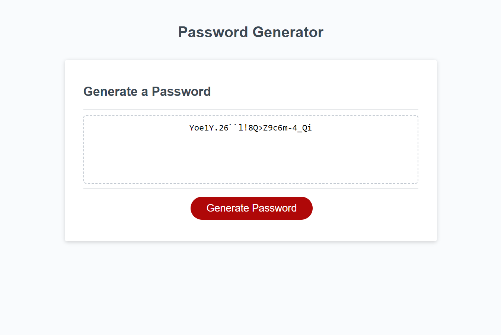

# Description
This webpage was made to allow a user to generate a secure password. 
# Usage
A user goes on the webpage with a text area and button to generate a password.  When the user clicks the button they are presented with a series of prompts asking them how long the password should be as well as which character types to include in the password.  The user's input is validated and can only continue if criteria is met.
That criteria is the password must be numeric and between 8 and 128 charaters long and they must choose at least one character type.  If the criteria is met a secure password is generated and displayed in the textarea.
# Screenshot

# Link to website
[My webpage](https://michaeloc1.github.io/module-3-password)
